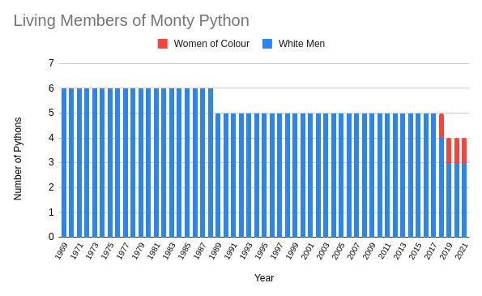

# Python der Pythonen

This project aims to close to loop on making it relevant to segue from talking about Python back to
its namesake, Monty Python. The secondary goal is to provide new Monty Python content when this lot
all kick the bucket.



Note that the above graph explicitly recognises that Loretta no longer wants to be considered a 
white male for the purposes of finding blame for everything that is wrong with the world.


## Running

First clone the repository and install textgenrnn:
```
git clone git@github.com:mensly/python-der-pythonen.git
pip install textgenrnn
```
If you end up with [an error related to multi_gpu_model](https://github.com/keras-team/keras/issues/14440)
like I did, you may need to grab the current development version of textgenrnn.
```
pip uninstall textgenrnn
git clone git@github.com:minimaxir/textgenrnn.git
pip install ./textgenrnn
```

Next you will need to download some input data for the `input.txt` file, the data needed can be 
found [online](https://www.intriguing.com/mp/scripts.php). If Monty Python's lawyers have this 
taken down, I'll throw them under a camel. Assuming you're lazy, this can be done for you:
```
./fetch-data.py
```

You can then force your computer to read nonsense:
```
./training.py
```

Finally, you can generate something funny:
```
./generate.py
less output.txt
```

## Customising
Go take a look at the options available for [textgenrnn](https://github.com/minimaxir/textgenrnn) 
then just tweak `training.py` and `generate.py` to suit. If you have some spare time on your hands,
I'll accept any PRs that add `argparse` to these scripts.


## Sample Output
TODO
